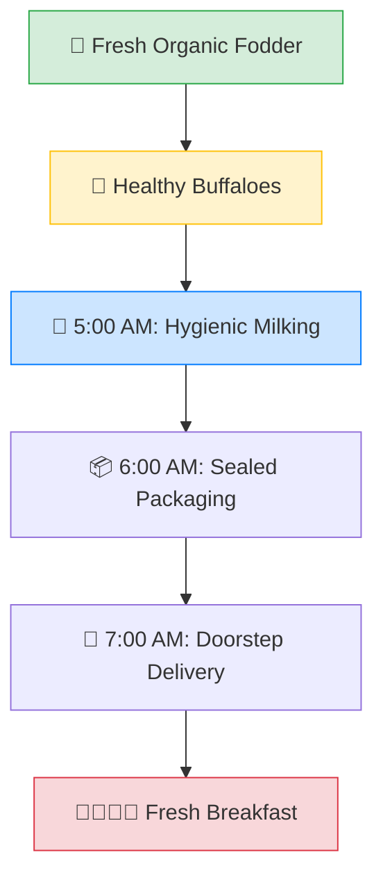
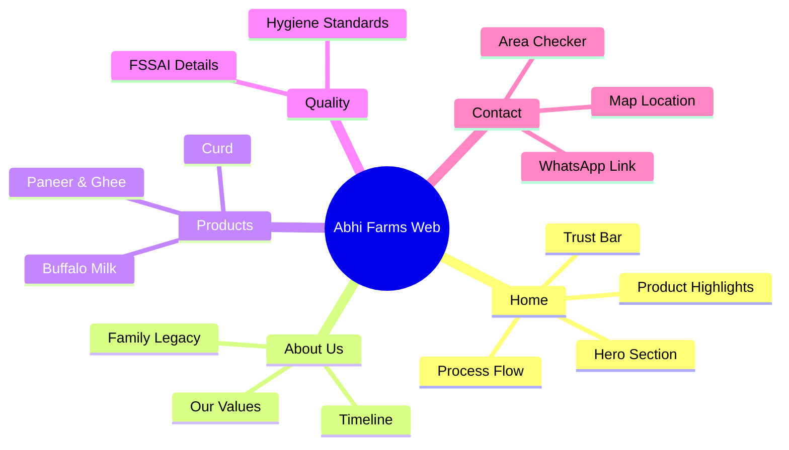

<div align="center">

# 🐃 Abhi Farms
### *Pure. Fresh. From Our Family to Yours.*

[](https://www.fssai.gov.in/)
[](https://wa.me/919XXXXXXXXX)
[](https://opensource.org/licenses/MIT)

---

**Experience the richness of 100% pure buffalo milk, delivered straight from our farm to your doorstep before the sun hits the horizon.**

[Explore Products](#-our-offerings) • [Why Abhi Farms?](#-the-abhi-farms-promise) • [Our Process](#-the-farm-to-home-journey) • [Contact Us](#-get-in-touch)

</div>

---

## 🌟 The Abhi Farms Promise

Abhi Farms isn't just a dairy — it's a family legacy passing through three generations. Based in the heart of rural India, we provide premium, unprocessed, and preservative-free dairy products to urban families who value purity above all else.

- **🚫 No Preservatives**: Zero chemicals, zero middleman, zero compromises.
- **🌿 Grass-Fed Health**: Our buffaloes graze on organic green fodder grown on our own land.
- **🚚 Morning Mastery**: Milked at dawn, delivered by 7 AM. Freshness you can taste.
- **✅ FSSAI Certified**: Fully compliant with the highest food safety and hygiene standards.

---

## 📦 Our Offerings

| Product | Description | Origin | Experience |
| :--- | :--- | :--- | :--- |
| **Fresh Buffalo Milk** | Rich, creamy, and high-protein. | 🏡 Farm Fresh | ⭐⭐⭐⭐⭐ |
| **Fresh Paneer** | Soft, melt-in-your-mouth texture. | 🧤 Handmade | ⭐⭐⭐⭐⭐ |
| **Pure Desi Ghee** | Golden, granular, aromatic. | 🏺 Bilona Method | ⭐⭐⭐⭐⭐ |
| **Natural Dahi** | Thick, creamy, and probiotic-rich. | ☀️ Naturally Set | ⭐⭐⭐⭐⭐ |

---

## 🚜 The Farm-to-Home Journey



---

## 💻 Tech & Architecture

This project is built with high-performance, vanilla web technologies to ensure lightning-fast load times and a premium user experience.

### **The Tech Stack**


### **Site Structure**


---

## 🚀 Getting Started

To view the website locally or contribute:

1. **Clone the repository**
   ```bash
   git clone https://github.com/tsanhith/abhi_farms.git
   ```
2. **Launch the site**
   Open `index.html` in any modern browser. No build steps required.

---

## 🤝 Get in Touch

We love hearing from our community. Whether you want to start a subscription or visit the farm, we're just a message away.

- **💬 WhatsApp**: [Chat with us](https://wa.me/919XXXXXXXXX)
- **✉️ Email**: [info@Abhifarms.com](mailto:info@Abhifarms.com)
- **📍 Location**: Abhi Farms Headquarters, [District], [State]
- **⏰ Delivery**: Daily 5:00 AM - 7:30 AM

---

<div align="center">

### Built with ❤️ by the Abhi Farms Family
*© 2026 Abhi Farms. All rights reserved.*

</div>
